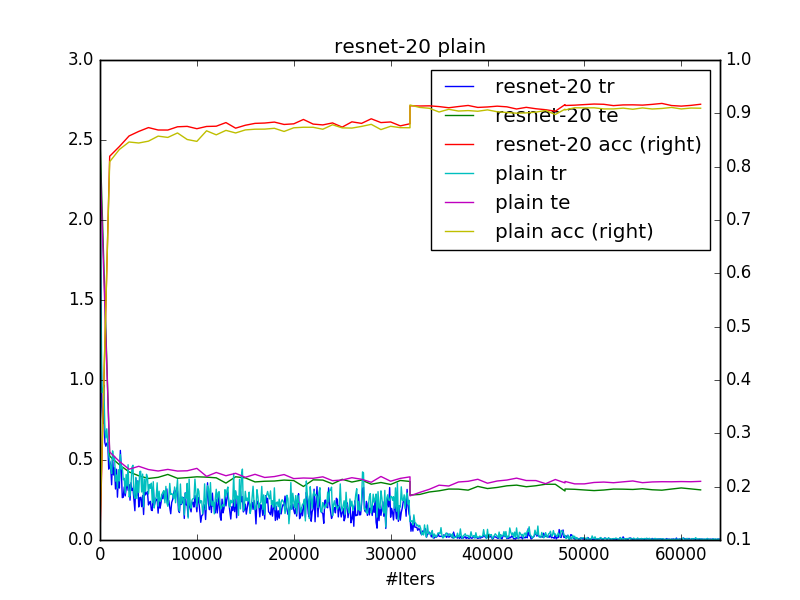
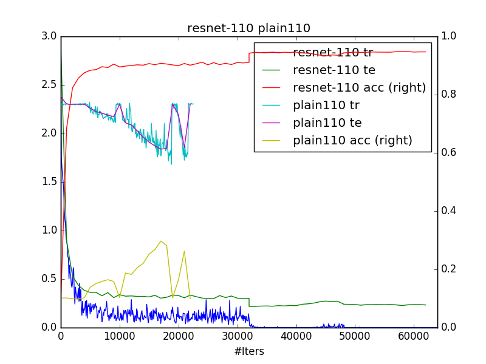

# ResNet 20/32/44/56/110 for CIFAR10 with caffe 
1. get cifar10 python version, then create a soft link `ln -s cifar-10-batches-py` here
2. use [data_utils.py](data_utils.py) to generate 4 pixel padded training data and testing data. Horizontal flip and random crop are performed on the fly while training.
3. use [net_generator.py](net_generator.py) to generate `solver.prototxt` and `trainval.prototxt`, you can generate resnet or plain net of depth 20 44 56 110, or even deeper if you want. you just need to change `n` according to `depth=6n+2`  
4. use [train.sh](train.sh) to train it (eg., `./train.sh 0,1,2,3 resnet-20`)
5. specify caffe path in [cfgs.py](cfgs.py) and use [plot.py](plot.py) to generate beautful loss plots.

### results are consistent with original paper
seems there's no much difference between resnet-20 and plain-20. However, from the second plot, you can see that plain-110 have difficulty to converge.

